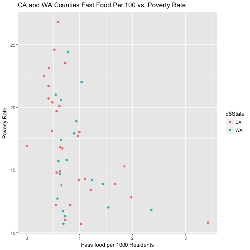

Overview
========================================================
author: Luke Shulman
date: 12/18/2016
autosize: true

Fast Food Data
========================================================

The USDA makes available a Food Environment Atlas containing almost 70 different variables on food access in US counties. 

The data has also been linked to Socio Economic data from the US Census and other sources. 

It can be found at [USDA Food Atlas](https://www.ers.usda.gov/data-products/food-environment-atlas/)


Experiment
========================================================

There has been tremendous attention paid to communities that only have access to fast food restaurants. 

- [Giving the Poor Easy Access to Healthy Food Doesn’t Mean They’ll Buy It](http://nyti.ms/1EnEVQN) *New York Times*
- [Zoning to Encourage Health Eating](https://www.cdc.gov/phlp/winnable/zoning_obesity.html) *CDC*
- [Toxic Food Environment](https://www.hsph.harvard.edu/obesity-prevention-source/obesity-causes/food-environment-and-obesity/) *Harvard Schol of Public Healht*

We will look at two variables "Poverty Rate", and "Median Household Income" to see if they have an effect on the number of Fast Food Restaurant penetration. 

Prepping the data
========================================================
Data for this pitch has been included in the github repository. It is taken from a downloadable excel from the USDA. 

<small>

```r
restaurantbase <- read.csv("./data/FoodAtlasRestaurantData.csv", stringsAsFactors = FALSE)
countysocial <- read.csv("./data/SocioEcoCounty.csv", stringsAsFactors = FALSE)
limitRestaurant <- restaurantbase[c("FIPS","State", "County","FSRPTH07", "PC_FFRSALES07")]
fullresult <- merge(limitRestaurant, countysocial, ID="FIPS" )
```
</small>

Results
========================================================
The full application is available as a shiny app. This plot shows the results for California and Washington state.

It shows no correlation.  
<small>

</small>
